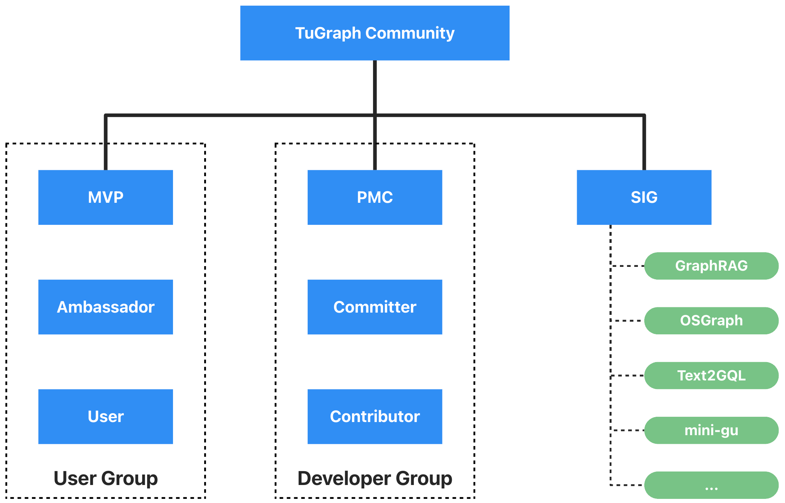

# TuGraph 社区

> 🌐️ 中文 | [English](../README.md)

**欢迎来到 TuGraph 社区 ！**

这是可以成为贡献者的起点：包括改进代码和文档、组织演讲等。

## 介绍
TuGraph社区是一个开源图技术社区，覆盖了图数据库、图计算引擎、图学习等基础技术，也包含了
结合大模型的 Text2GQL、GraphRAG、图智能体、图可视化等应用技术。我们期望打造全栈的图计算技术，
帮助个人开发者、商业公司、开源社区解决图数据的存储、计算、查询、分析、应用等多方位的问题。

## 架构

  

- [社区角色](ROLES-cn.md)：描述个人在 TuGraph 社区中可以承担的角色。
- [特别兴趣小组](SIGS-cn.md)： 为了增强社区成员之间的透明度和协作，TuGraph 创建了一系列特别兴趣小组（SIGs）。

访问[tugraph.tech](https://tugraph.tech)获取更多关于 TuGraph 使用的信息。

## 作者
TuGraph 是由蚂蚁集团图计算团队发起的一系列开源图计算项目集合，并拥有一个活跃的开发社区。

## 贡献
您可以参考[贡献文档](CONTRIBUTING-cn.md)，提交 GitHub Issue/PR 提供反馈建议对 TuGraph 继续改进。

## 联系
您可以通过下面提供的 TuGraph 微信群或 Discord 与我们直接联系。

- 微信：

- Discord：https://discord.gg/KBCFbNFj

## 会议

> 我们正在筹备社区会议的议程。

